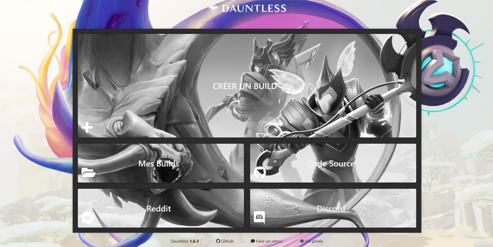

<p align="center">
  <a href=https://github.com/leghort/dauntless-builder-french/releases>
    
</p>

<p align="center">
  <a href="https://www.dauntless-builder.fr/">
    
  </a>
</p>

### Table des matières
**[Prérequis](https://github.com/leghort/dauntless-builder-french#prérequis)**</br>
**[Installation](https://github.com/leghort/dauntless-builder-french#installation)**</br>
**[Contact](https://github.com/leghort/dauntless-builder-french#contact)**</br>
**[Wiki](https://github.com/leghort/dauntless-builder-french/wiki)**</br>

## Prérequis

* [Nodejs 8.17.0+](https://nodejs.org/fr/)

## Installation
```shell
# Il faut d'abord installer yarn via:
npm install -g yarn

# Installer/mettre à jour toutes les dépendances via
yarn

# S'il s'agit d'une installation ou si des modifications ont été apportées aux données, vous devrez effectuer une compilation complète
yarn build

# compilation en mode dev
yarn build-dev

# Facultatif: vous pouvez aussi regarder/construire des données...
# yarn build-dev --watch

# Exécutez ensuite votre serveur web via
yarn dev

# La commande powershell que j'utilise pour compiler, faire un serveur web et ouvrir un onglet priver google chrome
yarn ; yarn build ; [System.Diagnostics.Process]::Start("chrome.exe","--incognito http://localhost:4000/") ; yarn dev
```

## Contact
<a href=https://discordapp.com/users/184411677469573121></a>
<a href=mailto:medaey@hotmail.com></a>
french-hardcoded
